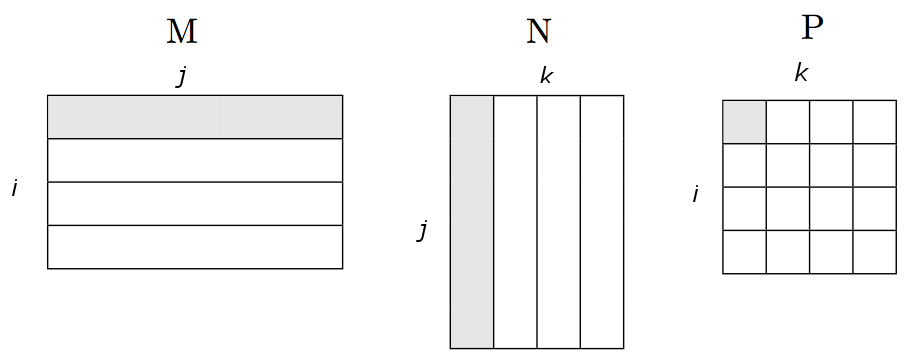
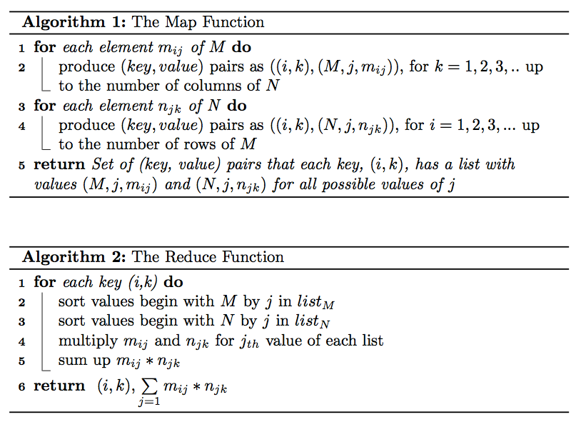
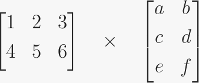
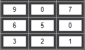
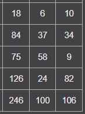

# Matrix Multiplication with Hadoop

Suppose we have a *p x q* matrix M, whose element in row i and column j will be denoted m<sub>ij</sub> and a *q x r* 
matrix N whose element in row *j* and column *k* is donated by *n<sub>jk</sub>* then the product *P = MN* will be *p x r* 
matrix P whose element in row *i* and column *k* will be donated by *P<sub>ik</sub>*, where *P(i,k) = m<sub>ij</sub>\*n<sub>jk</sub>*



## Data Model for MapReduce

Matrix M is represented with tuples *(i,j,m<sub>ij</sub>)*, and matrix N is represented with tuples *(j,k,n<sub>jk</sub>)*. Considering that most matrices are sparse in nature, cells that have values of zero can be ignored to save 
large amount of disk space. Matrix M and N are assumed to be followed the given format.

*M,i,j,m<sub>ij</sub>*

```bash
 M,0,0,10.0
 M,0,2,9.0
 M,0,3,9.0
 M,1,0,1.0
 M,1,1,3.0
 M,1,2,18.0
 M,1,3,25.2
 ....
```

N,j,k,n<sub>jk</sub>

```bash
 N,0,0,1.0
 N,0,2,3.0
 N,0,4,2.0
 N,1,0,2.0
 N,3,2,-1.0
 N,3,6,4.0
 N,4,6,5.0
 N,4,0,-1.0
 ....
```
Further, the matrix dimensions should be provided as a text file named 'config' residing in the same directory in which the input matrixes reside. 'm' is the number of rows in M, 'n' is the number of columns in M & 'p' is the number of columns in N.

config

```bash
 m,n,p
```

## Map-Reduce
We will write Map and Reduce functions to process input files. Map and reduce functions will implement the following 
algorithms:


Map function will produce *key,value* pairs from the input data as it is described in *Algorithm 1*. Reduce function 
uses the output of the Map function and performs the calculations and produces *key,value* pairs as described in 
*Algorithm 2*. All outputs are written to HDFS. The value in row i and column k of product matrix P will be:


Let me examine the algorithms on an example to explain better. Suppose we have two matrices, M, 2x3 matrix, and N, 3x2 
matrix as follows:



The product P of MN will be as follows:


### The Map Task

For matrix M, map task (Algorithm 1) will produce *key,value* pairs as follows:

(i,k), (M, j, m<sub>ij</sub>)

*m<sub>11</sub> = 1* \
*(1,1), (M, 1, 1) for k = 1* \
*(1,2), (M, 1, 1) for k = 2*

*m<sub>12</sub> = 2* \
*(1,1), (M, 2, 2) for k = 1* \
*(1,2), (M, 2, 2) for k = 2*

.........

*m<sub>23</sub> = 6* \
*(2,1), (M, 3, 6) for k = 1* \
*(2,2), (M, 3, 6) for k = 2*

For matrix N, map task (Algorithm 2) will produce *key,value* pairs as follows:


*(i,k),(N,j,n<sub>jk</sub>)*

n<sub>11</sub> = a \
*(1,1),(N,1,a) for i = 1* \
*(2,1),(N,1,a) for i = 2*

*n<sub>21</sub> = c* \
*(1,1),(N,2,c) for i = 1* \
*(2,1),(N,2,c) for i = 2*

*n<sub>31</sub> = e* \
*(1,1),(N,3,e) for i = 1* \
*(2,1),(N,3,e) for i = 2*

.......

*n<sub>32</sub> = f* \
*(1,2),(N,3,f) for i = 1* \
*(2,2),(N,3,f) for i = 2*

After combine operation the map task will return *key,value* pairs will look like as follows:

*( (i,k), [ (M, j, m<sub>ij</sub> ), (M, j, m<sub>ij</sub> ),..., (N, j, n<sub>jk</sub>), (N, j, n<sub>jk</sub>), .... ] )* \
*(1,1), [(M,1,1),(M,2,2),(M,3,3),(N,1,a,(N,2,c),(N,3,e)]* \
*(1,2), [(M,1,1),(M,2,2),(M,3,3),(N,1,b,(N,2,d),(N,3,f)]* \
*(2,1), [(M,1,4),(M,2,5),(M,3,6),(N,1,a,(N,2,c),(N,3,e)]* \
*(2,2), [(M,1,4),(M,2,5),(M,3,6),(N,1,b,(N,2,d),(N,3,f)]*

Note that the entries for the same key are grouped in the same list, which is performed by the framework. This
output will be stored in HDFS and feed the reduce task as input.

### The Reduce Task

Reduce task takes the `key,value` pairs as the input and process one key at a time. For each key it divides the
values in two separate lists for `M` and `N`. As an example, it will create the following list for key  
*(1,1)*: *[(M,1,1),(M,2,2),(M,3,3),(N,1,a,(N,2,c),(N,3,e)]*

Reduce task sorts the values begin with M in one list and values begin with N in another list as follows:

*l<sub>M</sub> = [(M,1,1),(M,2,2),(M,3,3)]* \
*l<sub>N</sub> = [(N,1,a),(N,2,c),(N,3,e)]*

then sums up the multiplication of m<sub>ij</sub> and n<sub>jk</sub> for each j as follows:

*P(1,1) = 1a + 2c + 3e*

The same computation applied to all input entries of reduce task.


for all i and k is then calculated as follows:_3

```bash
P(1,1) = 1a + 2c + 3e
P(1,2) = 1b + 2d + 3f
P(2,1) = 4a + 5c + 6e
P(2,2) = 4b + 5d + 6f
```

The product matrix P of MN is then generated as:


### Experiments

#### Datasets

#### input_1 - Small

M


N



Expected P



#### input_2 - Large

### Source Code

Mapper and reducer classes are `Map.java` and `Reduce.java` respectively. Main method in the `MatrixMultiply.java` 
class the configuration parameters are being set as well as the input/output directories of MapReduce job [2].

The Mapper class extends org.apache.hadoop.mapreduce.Mapper class and implements the map task described in Algorithm 1 
and creates the *key,value* pairs from the input files.

Reducer class extends org.apache.hadoop.mapreduce.Reducer class and implements the reduce task described in Algorithm 2 
and creates the *key,value* pairs for the product matrix then writes its output to HDFS.

### How to run

The packaged jar is available at 'artifacts' directory. \
Sample program arguments: <jar> input_1 output

References
--

[1] Anand Rajaraman and Jerey David Ullman. Mining of Massive Datasets.
Cambridge University Press, New York, NY, USA, 2011.

[2] One-step matrix multiplication with hadoop, [Online], 2014

